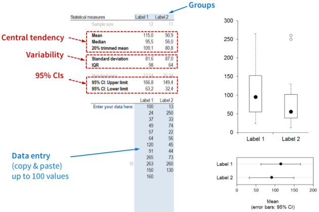

#### Box plot template: Instructions  {#instructions-box-plot}

Here you can produce side-by-side boxplots for up to 6 groups (with up to 100 scores in each group). Select the tab on the bottom left depending on how many groups you want to compare. Enter the data into the blue cells and the names for the groups at the top. The names will automatically appear on the plots. On the bottom right, you also see a dot plot of the means and 95 % confidence intervals for each group. You may need to manually adjust the axis settings in both plots.

