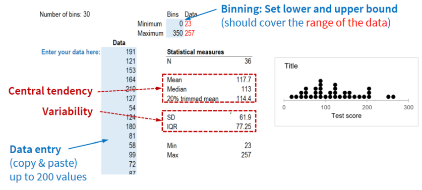

#### Dot diagram template: Instructions  {#instructions-dot-diagram}

This Excel template currently includes two tabs:

\  

##### Tab "30 bins - 1 group"

This template allows you to draw a dot diagram for a single distribution of scores. The number of bins is set to 30 (cannot be changed). Enter your data into the blue cells. Make sure you set appropriate binning limits in the pair of blue cells at the top. The template will create 30 equally-spaced bins between these limits (minimum, maximum) and then count the number of occurrences in each bin. The dot diagram will show a pile of points at the midpoint of the bin. The binning limits must cover the range of the scores in the data, which appear in red. If they do not, the dot diagram will look strange.

\  

##### Tab "30 bins - 5 groups"

Here you can do the same for up to 5 groups. Make sure the x-axes have the same range when comparing two or more dot diagrams.
