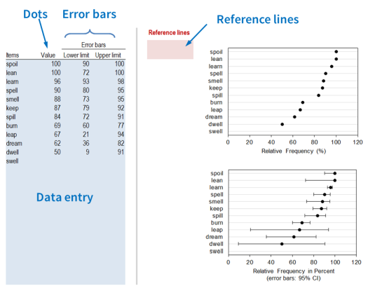
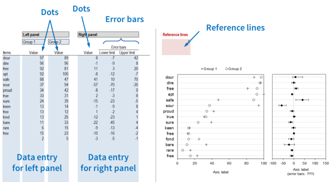

#### Dot plot template: Instructions  {#instructions-dot-plot}

This Excel template currently includes two tabs:

\  

##### Tab "One group"

Here you can produce a simple dot plot, optionally with error bars. Enter the values you want to plot (as well as the values for the upper and lower limit of the error bars) into the blue cells. In the red cells, you can type in values for reference lines in case you want to show any. You need to adjust the axis settings manually.

\  

##### Tab "Two groups"

Here you can produce a dot plot comparing two groups using different plotting symbols. Enter the values you want to plot and the group names into the blue cells. In the second block you can provide values for the appended panel: values for the dots and the values for the upper and lower limit of the error bars. In the red cells, you can type in values for reference lines in case you want to show any. You may need to adjust the axis settings manually.

\  