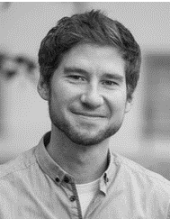

### Lukas Sönning

#### Post-doc in English linguistics at the University of Bamberg

- [University of Bamberg](https://www.uni-bamberg.de/)
- [Department of English Linguistics](https://www.uni-bamberg.de/eng-ling/)

#### Contact

- Address: An der Universität 9, D-96047 Bamberg
- Office: U9/01.11
- Phone: +49 (0)951/863-2267
- Email: lukas[dot]soenning[at]uni-bamberg[dot]de
- `r icons::academicons$orcid` ORCID ID [0000-0002-2705-395X](https://orcid.org/0000-0002-2705-395X)  
 
#### Research interests

- Statistical analysis of corpus data
- Language variation and change
- Grammatical alternations
- German Learner English
- L2 phonology
 