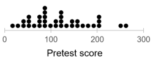
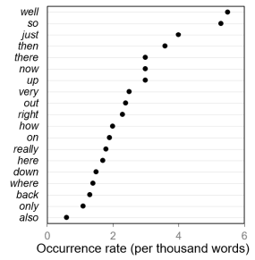
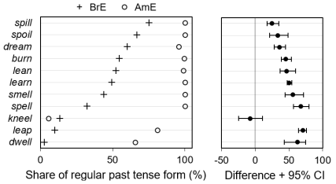
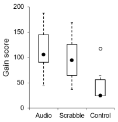
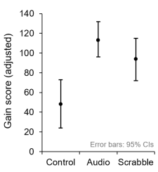
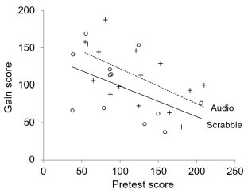

### Resources

##### Plot templates for Microsoft Excel 

Excel templates for some useful graph types can be found in the following `r icons::academicons$osf` [OSF project](https://osf.io/v37pw). 

- Dot diagram   
[template](https://osf.io/tjsaf) | [instructions](resources_pages/instructions_dot_diagram.html)

- Simple dot plot   
[template](https://osf.io/4scxt) | [instructions](resources_pages/instructions_dot_plot.html)

- Grouped dot plot   
[template](https://osf.io/4scxt) | [instructions](resources_pages/instructions_dot_plot.html)

- Box plot   
[template](https://osf.io/f46aq) | [instructions](resources_pages/instructions_box_plot.html)

- Vertical dot plot   
[template](https://osf.io/w4u7m)

- Scatter plot   
[template](https://osf.io/xajyk) | [instructions](resources_pages/instructions_scatter_plot.html)

##### Speaker slides for workshop

- Würzburg: [speaker slides part 1](resources_pages/slides_part_1-speaker.html){target="_blank"} | [speaker slides part 3](resources_pages/slides_part_3-speaker.html){target="_blank"} 
