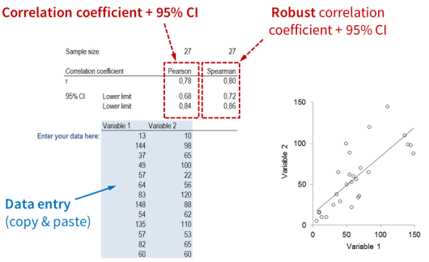
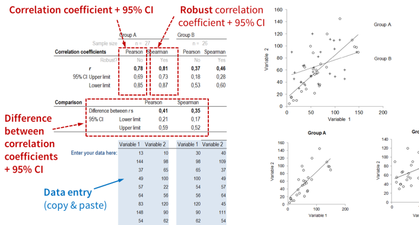

#### Scatter plot template: Instructions  {#instructions-scatter-plot}

This Excel template currently includes two tabs:

\  

##### Tab "One group"

Here you can produce a scatterplot of two quantitative variables for a single group. Enter the values you want to plot into the blue cells at the bottom. Two correlation coefficients are reported, which differ in their robustness. Spearman’s r generally relies less on distributional assumptions. It is good practice to compare the two and report both. In case they differ considerably (e.g. by more than .1), try to find out what causes the discrepancy. The reason is usually the presence of (one or more) outliers. In the scatterplot you need to change the axis titles and possibly also need to fine-tune the axis settings.

\  

##### Tab "Two groups"

Here you can produce a scatterplot of two quantitative variables comparing two groups. Enter the values you want to plot into the blue cells at the bottom. Two options are shown. In one plot the two groups are superposed, i.e. plotted into the same panel. This can produce a cluttered graph. In some cases, color can help considerably to discriminate the two groups. Feel free to apply color in this case. On the bottom, the two groups are juxtaposed, i.e. plotted into separate panels. This often produces for a cleaner picture and allows for more detailed comparisons within groups. If you show regression lines, label them directly. In the scatterplot you need to change the axis titles and possibly also need to fine-tune the axis settings.

The worksheet also returns the Pearson and Spearman correlation coefficients as well as their difference, all including 95% confidence intervals. Spearman’s r is more robust to deviations from distributional assumption. You should report and interpret both coefficients and their differences. If they disagree considerably (e.g. by more than .1), try to identify the cause for the discrepancy. This is usually due to outliers, which you can easily spot in the juxtaposed panels.

